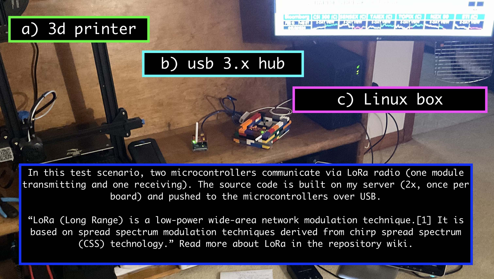
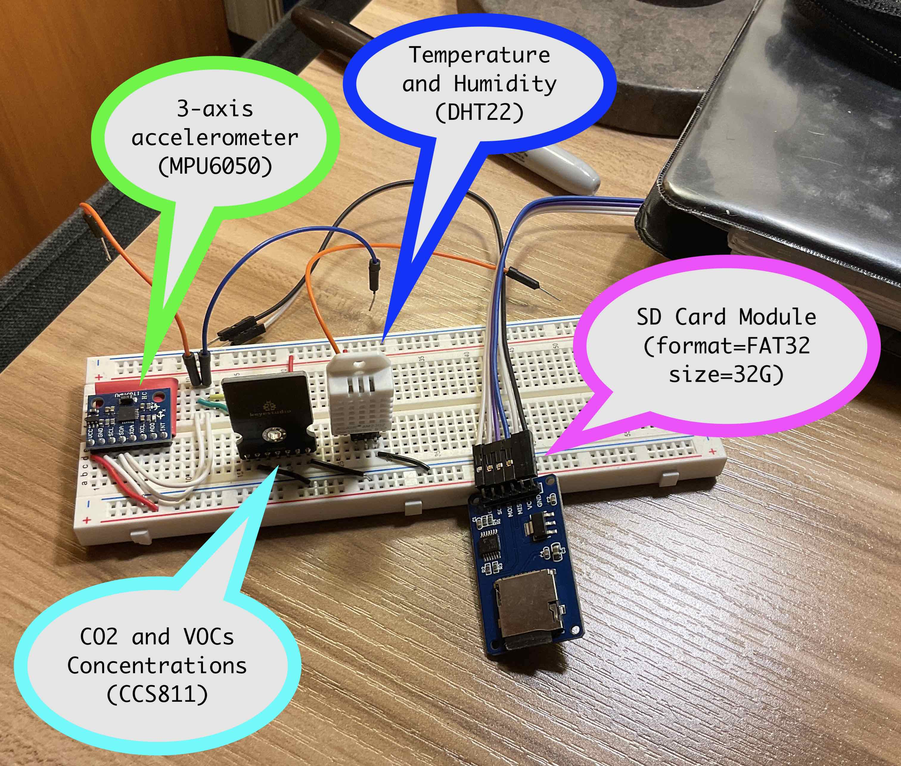

# near_space_balloons
Data, documentation, source code for my high altitude balloon project

I recently mentioned this project to some work colleagues. All seem interested to learn/discuss more! So, I'm in the process of reorganizing my working repository for this project (currently set to private) and merging that content into this one following the structure in this template project: https://github.com/ladislas/Bare-Arduino-Project/blob/master/INSTALL

### about the maker environment

The goal is to 3d print all unpowered components of the payload and supporting hardware, including:

* a payload casing (built partially with Legos) + mount points for sensors and the microcontroller board
* an enclosure for the LoRaWAN gateway (permanently located outdoors) which provides wide-area comms
* a powered winch for controlled deployments of the test payload using a moored balloon (prototype phase)

### about the sensors/modules

*Coming Soon*

Each aspect of the build will also be thoroughly documented in the wiki. This README is just for high-level info.

*The photo above shows breadboard circuits for some of the payload modules.*

### about the software environment

*Coming Soon*

#### my linux box

Boots to Debian 10 (buster) by default. All third-party apps run in Docker containers. I manage them through simple browser interface (1). GUI apps served by X.Org Server are accessible on LAN.

A dedicated AWS user uses the CLI to integrate with AWS cloud. Build and push code directory to attached microcontrollers, or use the Arduino Cloud API to push code to boards with a wifi module (ESP32). 
